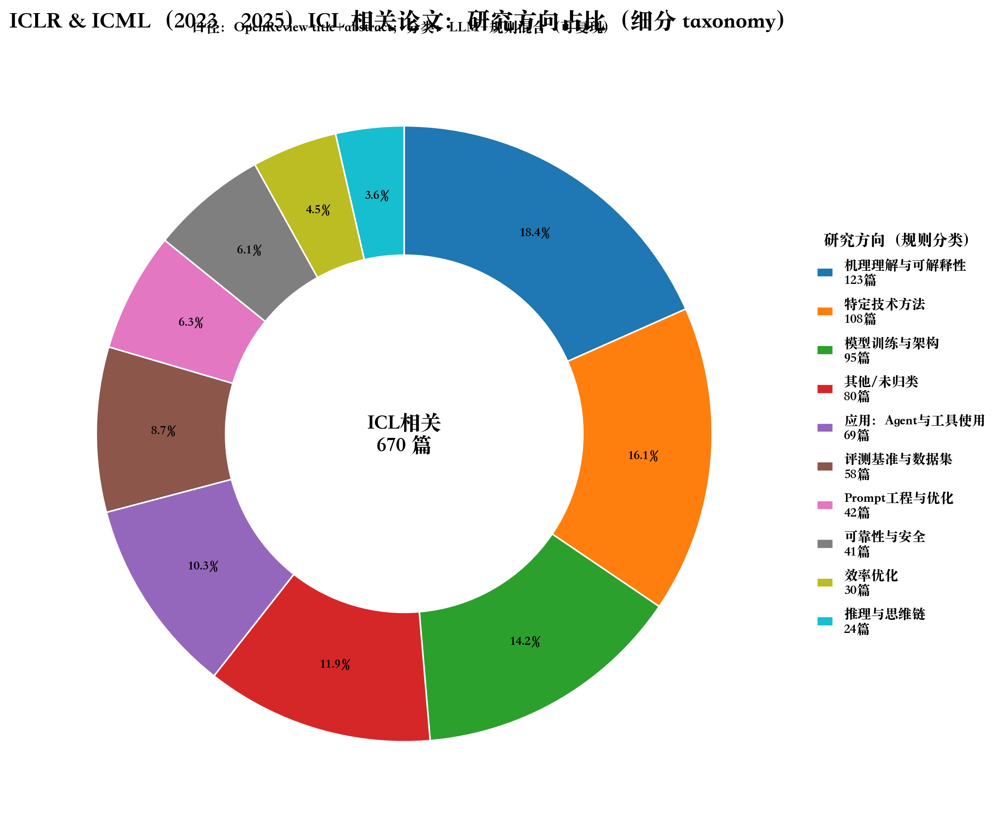
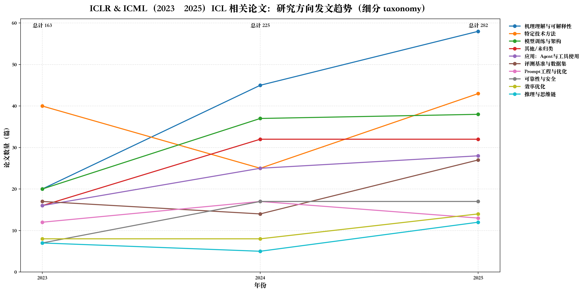

# 📊 OpenReview 学术论文智能分析工具

[](https://www.python.org/downloads/)
[](LICENSE)
[](https://platform.openai.com)

> 🎓 从 OpenReview 自动抓取、智能分类和可视化 ICLR/ICML 等顶会论文
> 🤖 支持规则分类和 LLM 智能分类的混合策略
> 🔧 零代码修改即可适配任意研究领域

**默认聚焦 In-Context Learning (ICL)** 研究,包含 9 大类别分类体系。通过简单配置可扩展至其他领域。

## 📸 运行结果展示

<div align="center">


</div>

---

## ✨ 核心特性

### 🤖 智能分类系统
- **三种分类模式**: 规则分类(快速免费) / LLM 分类(高准确) / 混合策略(推荐)
- **自动缓存**: LLM 结果持久化,避免重复 API 调用
- **置信度回退**: 低置信度自动降级为规则分类
- **断点续传**: 支持中断恢复

### 📊 数据处理与可视化
- **自动抓取**: 从 OpenReview API 批量获取论文元数据
- **多年份支持**: 可同时分析多个年份会议数据
- **精美图表**: 自动生成饼图和折线图
- **中文友好**: 智能字体检测,支持中英文混排

### 🔧 灵活配置
- **配置驱动**: 通过 `config.json` 管理参数
- **零代码扩展**: 通过配置研究任意领域
- **命令行优先**: 参数可覆盖配置文件
- **多 API 兼容**: 支持 OpenAI、智谱、本地模型等

## 📋 目录

- [快速开始](#-快速开始)
- [安装](#-安装)
- [配置](#-配置)
- [使用方法](#-使用方法)
- [ICL 分类体系](#-icl-分类体系)
- [工作流程](#-工作流程)
- [输出文件说明](#-输出文件说明)
- [高级功能](#-高级功能)
- [常见问题](#-常见问题)
- [项目架构](#-项目架构)

## 🚀 快速开始

### 一分钟体验

```bash
# 1. 克隆仓库
git clone <repository-url>
cd openreview-icl-tool

# 2. 安装依赖
pip install requests pandas tqdm matplotlib

# 3. 立即运行(使用规则分类)
python3 openreview_icl_crawl_and_plot.py --years 2024

# 4. 查看结果
ls out/  # 生成的 CSV 和图表在这里
```

### 🤖 启用 LLM 智能分类(可选)

```bash
# 1. 安装 OpenAI 库
pip install openai

# 2. 配置 API 密钥
cp config.example.json config.json
# 编辑 config.json,填入你的 API 信息

# 3. 运行 LLM 模式
python3 openreview_icl_crawl_and_plot.py --use_llm --years 2024
```

## 📦 安装

**系统要求**: Python 3.7+, 能访问 OpenReview API

```bash
# 基础安装(仅规则分类)
pip install requests pandas tqdm matplotlib

# 完整安装(含 LLM 功能)
pip install requests pandas tqdm matplotlib openai
```

## ⚙️ 配置

本工具采用 **配置文件 + 命令行参数** 的双层配置系统,灵活且安全。

### 配置文件结构

创建 `config.json`(基于 [config.example.json](config.example.json)):

```json
{
  "api": {
    "api_base": "https://api.openai.com/v1",
    "api_key": "YOUR_API_KEY_HERE",
    "model": "gpt-3.5-turbo",
    "max_rpm": 60
  },
  "data_fetch": {
    "years": [2023, 2024, 2025],
    "conferences": ["ICLR", "ICML"]
  },
  "classification": {
    "use_llm": false,
    "llm_confidence_threshold": 0.6
  }
}
```

### 核心配置项

**API 配置**(LLM 功能必需):
- `api_base`: API 端点(支持 OpenAI、智谱、本地模型等)
- `api_key`: API 密钥
- `model`: 模型名称
- `max_rpm`: 每分钟最大请求数

**数据抓取**:
- `years`: 年份列表,如 `[2023, 2024, 2025]`
- `conferences`: 会议列表,如 `["ICLR", "ICML"]`

**分类配置**:
- `use_llm`: 是否启用 LLM 分类
- `llm_confidence_threshold`: 置信度阈值(默认 0.6)

**配置优先级**: 命令行参数 > 配置文件 > 默认值

**安全提示**: 将 `config.json` 添加到 `.gitignore`,避免泄露 API 密钥

## 📖 使用方法

### 基础模式:快速统计

```bash
# 使用默认配置(规则分类)
python3 openreview_icl_crawl_and_plot.py

# 指定年份
python3 openreview_icl_crawl_and_plot.py --years 2024 2025

# 指定会议和年份
python3 openreview_icl_crawl_and_plot.py --confs ICLR --years 2025

# 静默模式(减少日志)
python3 openreview_icl_crawl_and_plot.py --quiet
```

### LLM 模式:智能分类

```bash
# 启用 LLM(从配置文件读取 API)
python3 openreview_icl_crawl_and_plot.py --use_llm

# 临时覆盖 API 配置
python3 openreview_icl_crawl_and_plot.py \
  --use_llm \
  --llm_api_key "your-api-key" \
  --llm_model "gpt-4"

# 使用智谱 API
python3 openreview_icl_crawl_and_plot.py \
  --use_llm \
  --llm_api_base "https://open.bigmodel.cn/api/paas/v4" \
  --llm_model "glm-4"
```

### 自定义主题研究

研究任意学术领域,无需修改代码:

```bash
# 示例 1:多模态学习
python3 openreview_icl_crawl_and_plot.py \
  --topic "multimodal learning" \
  --categories "视觉语言融合:vision,language,VLM;跨模态检索:retrieval,cross-modal;图像生成:generation,diffusion" \
  --years 2024 2025

# 示例 2:强化学习
python3 openreview_icl_crawl_and_plot.py \
  --topic "reinforcement learning" \
  --categories "策略优化:policy,PPO,TRPO;值函数:value,Q-learning;离线强化学习:offline,batch" \
  --years 2024
```

**分类格式说明**: `类别名称:关键词1,关键词2,关键词3;下一个类别:关键词A,关键词B`

### 高级功能

```bash
# 从已有 CSV 重新生成图表(不重新抓取)
python3 openreview_icl_crawl_and_plot.py --plot_only

# 调整置信度阈值(控制 LLM vs 规则比例)
python3 openreview_icl_crawl_and_plot.py \
  --use_llm \
  --llm_confidence_threshold 0.8  # 更严格,更多回退规则

# 自定义字体(解决中文显示问题)
python3 openreview_icl_crawl_and_plot.py --font "PingFang SC"  # macOS
python3 openreview_icl_crawl_and_plot.py --font "Microsoft YaHei"  # Windows
```

### 辅助工具

```bash
# 重新分类已有数据
python3 reclassify_with_llm.py

# 测试 LLM 功能
python3 test_llm_classify.py

# 检查 API 可用模型
python3 check_api_models.py
```

## 🏷️ ICL 分类体系

内置 9 大核心类别,覆盖 In-Context Learning 研究全景:

| 类别 | 研究方向 |
|------|---------|
| 📚 **Prompt工程与优化** | 示例选择、排序、模板设计 |
| 🧠 **推理与思维链** | CoT、多步推理、自洽性 |
| 🔬 **机理理解与可解释性** | 机制分析、诱导头、电路分析 |
| 🏗️ **模型训练与架构** | 预训练方法、架构变体 |
| ⚡ **效率优化** | 上下文压缩、KV缓存、长度外推 |
| 📊 **评测基准与数据集** | 基准构建、评测方法 |
| 🤖 **Agent与工具使用** | 规划、工具调用 |
| 🛡️ **可靠性与安全** | 校准、鲁棒性、隐私 |
| 🎯 **特定技术方法** | kNN-ICL、从错误学习 |

### 分类方法对比

| 特性 | 规则分类 | LLM 分类 | 混合策略(推荐) |
|------|---------|---------|----------------|
| **准确性** | ~70% | ~90% | ~88% |
| **成本** | 免费 | $0.002-0.01/篇 | $0.001-0.005/篇 |
| **速度** | 1000篇/秒 | 10篇/秒 | 50篇/秒 |

**混合策略**: LLM 优先,低置信度(<0.6)自动回退规则分类,结果自动缓存

## 🔄 工作流程

1. **数据抓取**: 从 OpenReview API 获取论文元数据
2. **主题过滤**: 根据关键词筛选相关论文
3. **智能分类**: 规则/LLM/混合策略分类
4. **结果输出**: 生成 CSV 文件(简化版+详细版)
5. **可视化**: 自动绘制饼图和趋势图

## 📁 输出文件说明

运行后在 `out/` 目录生成:

```
out/
├── icl_papers_filtered.csv              # 简化版论文列表
├── icl_papers_classified_detailed.csv   # 详细版(含置信度、理由)
├── icl_pie_donut_refined.png           # 类别分布饼图
├── icl_trend_lines_refined.png         # 年度趋势图
└── llm_cache.json                      # LLM 缓存(可选)
```

**详细版 CSV 关键字段**:
- `category_label`: 类别标签(含 emoji)
- `method`: 分类方法(`rule`/`llm`/`hybrid`)
- `confidence`: 置信度(0-1,仅 LLM)
- `reasoning`: 分类理由(仅 LLM)

## 🚀 高级功能

### 自定义主题和类别

**零代码扩展**:通过配置即可研究任意领域

```bash
# 在配置文件中设置
{
  "custom_taxonomy": {
    "topic": "multimodal learning",
    "categories": "视觉语言:vision,language;跨模态:cross-modal,retrieval"
  }
}

# 或通过命令行
python3 openreview_icl_crawl_and_plot.py \
  --topic "graph neural network" \
  --categories "图分类:graph classification;图生成:graph generation"
```

### 性能调优

```bash
# 调整速率限制(避免触发 API 限流)
python3 openreview_icl_crawl_and_plot.py \
  --use_llm \
  --llm_max_rpm 20 \
  --llm_batch_size 5

# 断点续传(处理大规模数据)
python3 openreview_icl_crawl_and_plot.py \
  --use_llm \
  --checkpoint_file "checkpoint.json"
# 中断后重新运行相同命令即可从断点继续
```

### 使用不同 API 提供商

```bash
# 智谱 GLM-4
python3 openreview_icl_crawl_and_plot.py \
  --use_llm \
  --llm_api_base "https://open.bigmodel.cn/api/paas/v4" \
  --llm_model "glm-4"

# 本地部署模型(vLLM/Ollama)
python3 openreview_icl_crawl_and_plot.py \
  --use_llm \
  --llm_api_base "http://localhost:8000/v1" \
  --llm_model "llama-3-8b" \
  --llm_api_key "dummy"
```

## ❓ 常见问题

**Q1: 中文显示为方框?**
```bash
python3 openreview_icl_crawl_and_plot.py --font "PingFang SC"  # macOS
python3 openreview_icl_crawl_and_plot.py --font "Microsoft YaHei"  # Windows
```

**Q2: LLM API 调用失败?**
检查 API key、endpoint、模型名称是否正确,可运行 `python3 check_api_models.py` 测试

**Q3: "其他/未归类" 占比过高?**
使用 LLM 分类: `python3 openreview_icl_crawl_and_plot.py --use_llm`

**Q4: 如何重新分类已有数据?**
运行 `python3 reclassify_with_llm.py` 或使用 `--plot_only` 模式

**Q5: 如何保护 API 密钥?**
将 `config.json` 添加到 `.gitignore`,不要在命令行中直接传递 API key

## 🏗️ 项目架构

### 核心模块

| 模块 | 职责 |
|------|------|
| **openreview_icl_crawl_and_plot.py** | 主程序入口 |
| **config_loader.py** | 配置管理 |
| **icl_fetcher.py** | OpenReview 数据抓取 |
| **icl_taxonomy.py** | ICL 分类体系定义 |
| **icl_classifier.py** | 智能分类(规则/LLM/混合) |
| **icl_plotter.py** | 数据可视化 |
| **custom_taxonomy.py** | 自定义主题扩展 |

### 辅助工具

- `reclassify_with_llm.py`: 重新分类工具
- `test_llm_classify.py`: LLM 功能测试
- `check_api_models.py`: API 连接测试

---

## 📜 许可证

本项目采用 **MIT 许可证** - 详见 [LICENSE](LICENSE) 文件

## 🙏 致谢

感谢 [OpenReview](https://openreview.net/) 提供的优秀 API

---

<div align="center">

**更新日期**: 2025-12-27

⭐ **如果这个项目对您有帮助,请给我们一个 Star!** ⭐

</div>
