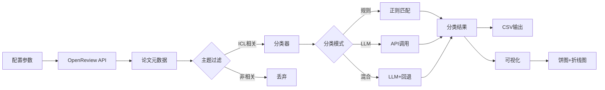
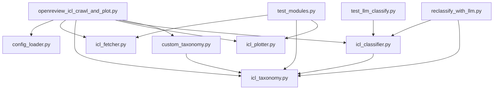

# 📊 OpenReview 学术论文智能分析工具

[](https://www.python.org/downloads/)
[](LICENSE)
[](https://platform.openai.com)

> 🎓 从 OpenReview 自动抓取、智能分类和可视化 ICLR/ICML 等顶会论文
> 🤖 支持规则分类和 LLM 智能分类的混合策略
> 🔧 开箱即用，零代码修改即可适配任意研究领域

**默认聚焦 In-Context Learning (ICL)** 研究，包含精心设计的 9 大类别分类体系。通过简单配置，可扩展至多模态学习、强化学习等任意领域。

---

## ✨ 核心特性

### 🤖 智能分类系统
- **三种分类模式**：规则分类（快速免费）/ LLM 分类（高准确）/ 混合策略（推荐）
- **自动缓存**：LLM 分类结果持久化，避免重复 API 调用
- **置信度回退**：LLM 低置信度自动降级为规则分类，确保质量
- **断点续传**：大规模数据处理支持中断恢复

### 📊 数据处理与可视化
- **自动抓取**：从 OpenReview API 批量获取 ICLR/ICML 论文元数据
- **多年份支持**：可同时分析多个年份的会议数据
- **精美图表**：自动生成饼图（类别分布）和折线图（年度趋势）
- **中文友好**：智能字体检测，完美支持中英文混排

### 🔧 灵活配置与扩展
- **配置文件驱动**：通过 `config.json` 集中管理参数，避免硬编码
- **零代码扩展**：通过配置即可研究任意领域（无需修改代码）
- **命令行优先**：命令行参数可覆盖配置文件设置
- **模块化架构**：清晰的代码分层，易于二次开发

### 💡 专为研究者设计
- **ICL 专项分类**：内置 9 大核心类别，覆盖 ICL 研究全景
- **自定义分类体系**：支持定义任意主题和类别关键词
- **详细输出**：提供简化版和详细版 CSV（含置信度、分类理由）
- **多 API 兼容**：支持 OpenAI、智谱、本地模型等任何兼容 API

## 📋 目录

- [快速开始](#-快速开始)
- [安装](#-安装)
- [配置](#-配置)
- [使用方法](#-使用方法)
- [ICL 分类体系](#-icl-分类体系)
- [工作流程](#-工作流程)
- [输出文件说明](#-输出文件说明)
- [高级功能](#-高级功能)
- [常见问题](#-常见问题)
- [项目架构](#-项目架构)
- [贡献指南](#-贡献指南)

## 🚀 快速开始

### 一分钟体验

```bash
# 1. 克隆仓库
git clone <repository-url>
cd openreview-icl-tool

# 2. 安装依赖（基础功能）
pip install requests pandas tqdm matplotlib

# 3. 立即运行（使用规则分类）
python3 openreview_icl_crawl_and_plot.py --years 2024

# 4. 查看结果
ls out/  # 生成的 CSV 和图表在这里
```

输出示例：
```
out/
├── icl_papers_filtered.csv          # 筛选后的论文列表
├── icl_pie_donut_refined.png       # 类别分布饼图
└── icl_trend_lines_refined.png     # 年度趋势图
```

### 🤖 启用 LLM 智能分类（可选）

```bash
# 1. 安装 OpenAI 库
pip install openai

# 2. 配置 API 密钥
cp config.example.json config.json
# 编辑 config.json，填入你的 API 信息

# 3. 运行 LLM 模式
python3 openreview_icl_crawl_and_plot.py --use_llm --years 2024
```

## 📦 安装

### 系统要求

- **Python**: 3.7 或更高版本
- **网络**: 能访问 OpenReview API

### 依赖包

| 包名 | 版本要求 | 用途 | 必需性 |
|------|---------|------|--------|
| `requests` | 任意 | OpenReview API 请求 | ✅ 必需 |
| `pandas` | 任意 | 数据处理和分析 | ✅ 必需 |
| `tqdm` | 任意 | 进度条显示 | ✅ 必需 |
| `matplotlib` | 任意 | 图表绘制 | ✅ 必需 |
| `openai` | >= 1.0 | LLM 分类（支持所有兼容 API）| ⚠️ 可选 |

### 安装命令

```bash
# 基础安装（仅规则分类）
pip install requests pandas tqdm matplotlib

# 完整安装（含 LLM 功能）
pip install requests pandas tqdm matplotlib openai
```

## ⚙️ 配置

本工具采用 **配置文件 + 命令行参数** 的双层配置系统，灵活且安全。

### 配置文件结构

创建 `config.json`（基于 [config.example.json](config.example.json)）：

```json
{
  "api": {
    "api_base": "https://api.openai.com/v1",
    "api_key": "YOUR_API_KEY_HERE",
    "model": "gpt-3.5-turbo",
    "max_rpm": 60
  },
  "data_fetch": {
    "years": [2023, 2024, 2025],
    "conferences": ["ICLR", "ICML"]
  },
  "classification": {
    "use_llm": false,
    "llm_batch_size": 10,
    "llm_confidence_threshold": 0.6
  },
  "output": {
    "output_dir": "out",
    "topk_trends": 12
  }
}
```

### 核心配置项

<details>
<summary><b>🔑 API 配置</b>（LLM 功能必需）</summary>

| 参数 | 说明 | 默认值 |
|------|------|--------|
| `api_base` | API 端点（支持 OpenAI 兼容） | `https://api.openai.com/v1` |
| `api_key` | API 密钥 | - |
| `model` | 模型名称 | `gpt-3.5-turbo` |
| `max_rpm` | 每分钟最大请求数（速率限制） | `60` |

**支持的 API 提供商**：
- OpenAI 官方 API
- Azure OpenAI
- 智谱 GLM (`https://open.bigmodel.cn/api/paas/v4`)
- 本地部署（vLLM/Ollama）
- 任何 OpenAI 兼容 API

</details>

<details>
<summary><b>📥 数据抓取配置</b></summary>

| 参数 | 说明 | 示例 |
|------|------|------|
| `years` | 抓取年份列表 | `[2023, 2024, 2025]` |
| `conferences` | 会议列表 | `["ICLR", "ICML"]` |
| `timeout` | HTTP 请求超时（秒） | `60` |

</details>

<details>
<summary><b>🏷️ 分类配置</b></summary>

| 参数 | 说明 | 推荐值 |
|------|------|--------|
| `use_llm` | 是否启用 LLM 分类 | `false`（规则）/ `true`（LLM） |
| `llm_batch_size` | LLM 批处理大小 | `10` |
| `llm_confidence_threshold` | 置信度阈值 | `0.6`（低于此值回退规则） |
| `cache_file` | LLM 缓存文件路径 | `llm_cache.json` |

</details>

### 配置优先级

**命令行参数 > 配置文件 > 默认值**

```bash
# 配置文件中 years=[2023, 2024]
# 命令行覆盖为 2025
python3 openreview_icl_crawl_and_plot.py --years 2025
```

### 🔒 安全最佳实践

```bash
# ✅ 推荐：配置文件管理 API 密钥
cp config.example.json config.json
echo "config.json" >> .gitignore  # 防止提交到 Git

# ❌ 避免：命令行直接暴露密钥
# python3 script.py --llm_api_key "sk-xxx"  # 会留在 shell 历史中
```

## 📖 使用方法

### 基础模式：快速统计

```bash
# 使用默认配置（规则分类）
python3 openreview_icl_crawl_and_plot.py

# 指定年份
python3 openreview_icl_crawl_and_plot.py --years 2024 2025

# 指定会议和年份
python3 openreview_icl_crawl_and_plot.py --confs ICLR --years 2025

# 静默模式（减少日志）
python3 openreview_icl_crawl_and_plot.py --quiet
```

### LLM 模式：智能分类

```bash
# 启用 LLM（从配置文件读取 API）
python3 openreview_icl_crawl_and_plot.py --use_llm

# 临时覆盖 API 配置
python3 openreview_icl_crawl_and_plot.py \
  --use_llm \
  --llm_api_key "your-api-key" \
  --llm_model "gpt-4"

# 使用智谱 API
python3 openreview_icl_crawl_and_plot.py \
  --use_llm \
  --llm_api_base "https://open.bigmodel.cn/api/paas/v4" \
  --llm_model "glm-4"
```

### 自定义主题研究

研究任意学术领域，无需修改代码：

```bash
# 示例 1：多模态学习
python3 openreview_icl_crawl_and_plot.py \
  --topic "multimodal learning" \
  --categories "视觉语言融合:vision,language,VLM;跨模态检索:retrieval,cross-modal;图像生成:generation,diffusion" \
  --years 2024 2025

# 示例 2：强化学习
python3 openreview_icl_crawl_and_plot.py \
  --topic "reinforcement learning" \
  --categories "策略优化:policy,PPO,TRPO;值函数:value,Q-learning;离线强化学习:offline,batch" \
  --years 2024

# 示例 3：图神经网络
python3 openreview_icl_crawl_and_plot.py \
  --topic "graph neural network" \
  --categories "图分类:graph classification,GNN;节点嵌入:node embedding;图生成:graph generation" \
  --years 2023 2024
```

**分类格式说明**：`类别名称:关键词1,关键词2,关键词3;下一个类别:关键词A,关键词B`

### 高级功能

```bash
# 从已有 CSV 重新生成图表（不重新抓取）
python3 openreview_icl_crawl_and_plot.py --plot_only

# 指定 CSV 文件路径
python3 openreview_icl_crawl_and_plot.py \
  --plot_only \
  --data_csv out/icl_papers_filtered.csv

# 调整置信度阈值（控制 LLM vs 规则比例）
python3 openreview_icl_crawl_and_plot.py \
  --use_llm \
  --llm_confidence_threshold 0.8  # 更严格，更多回退规则

# 自定义字体（解决中文显示问题）
python3 openreview_icl_crawl_and_plot.py --font "PingFang SC"  # macOS
python3 openreview_icl_crawl_and_plot.py --font "Microsoft YaHei"  # Windows

# 断点续传（大规模数据处理）
python3 openreview_icl_crawl_and_plot.py \
  --use_llm \
  --checkpoint_file "classification_checkpoint.json"
```

### 辅助工具

```bash
# 重新分类已有数据
python3 reclassify_with_llm.py

# 测试所有模块
python3 test_modules.py

# 测试 LLM 功能
python3 test_llm_classify.py

# 检查 API 可用模型
python3 check_api_models.py
```

## 🏷️ ICL 分类体系

工具内置精心设计的 9 大核心类别，覆盖 In-Context Learning 研究全景：

| 类别 | 研究方向 | 关键词示例 |
|------|---------|-----------|
| 📚 **Prompt工程与优化** | 示例选择、示例排序、prompt模板设计 | example selection, prompt ordering |
| 🧠 **推理与思维链** | CoT、多步推理、自洽性、思维树 | chain-of-thought, self-consistency |
| 🔬 **机理理解与可解释性** | 机制分析、理论证明、诱导头、电路分析 | induction head, interpretability |
| 🏗️ **模型训练与架构** | 预训练方法、架构变体、注意力机制 | pretrain, architecture, attention |
| ⚡ **效率优化** | 上下文压缩、KV缓存、长度外推 | compression, efficient, length extrapolation |
| 📊 **评测基准与数据集** | 基准构建、评测方法、综述 | benchmark, evaluation, survey |
| 🤖 **Agent与工具使用** | 规划、工具调用、函数调用 | agent, tool use, function calling |
| 🛡️ **可靠性与安全** | 校准、鲁棒性、隐私、攻击防御 | calibration, robustness, safety |
| 🎯 **特定技术方法** | kNN-ICL、从错误学习、自我修正 | kNN, learning from mistakes |

### 分类方法对比

| 特性 | 规则分类 | LLM 分类 | **混合策略（推荐）** |
|------|---------|---------|---------------------|
| **准确性** | 中等（~70%） | 高（~90%） | 高（~88%） |
| **成本** | 免费 | $0.002-0.01/篇 | $0.001-0.005/篇 |
| **速度** | 快（1000篇/秒） | 慢（10篇/秒） | 中等（50篇/秒） |
| **可解释性** | 关键词匹配 | 详细理由 | 两者兼具 |
| **适用场景** | 快速筛选 | 精细研究 | 生产环境 |

**混合策略工作原理**：
1. 优先使用 LLM 分类（获得高准确度和详细理由）
2. 如果 LLM 置信度 < 阈值（默认 0.6），自动回退到规则分类
3. 所有 LLM 结果自动缓存到 `llm_cache.json`，重复运行零成本

## 🔄 工作流程



### 详细步骤

1. **数据抓取**：从 OpenReview API 获取指定会议和年份的论文
2. **主题过滤**：根据 title/abstract 关键词筛选相关论文
3. **智能分类**：使用规则/LLM/混合策略对论文分类
4. **结果输出**：生成 CSV 文件（简化版+详细版）
5. **数据可视化**：自动绘制饼图和趋势图

## 📁 输出文件说明

运行完成后，在输出目录（默认 `out/`）生成以下文件：

### ICL 模式

```
out/
├── icl_papers_filtered.csv              # 简化版论文列表
├── icl_papers_classified_detailed.csv   # 详细分类结果（含置信度、理由）
├── fetch_meta.csv                       # 数据抓取元信息
├── icl_pie_donut_refined.png           # 类别占比饼图
├── icl_trend_lines_refined.png         # 发文趋势折线图
└── llm_cache.json                      # LLM 分类缓存（如使用 LLM）
```

### 自定义模式

```
out/
├── custom_papers_filtered.csv           # 简化版论文列表
├── custom_papers_classified_detailed.csv # 详细分类结果
├── custom_pie_donut_refined.png        # 类别占比饼图
└── custom_trend_lines_refined.png      # 发文趋势折线图
```

### 文件字段说明

**简化版 CSV** (`icl_papers_filtered.csv`)：
```csv
conf,year,title,abstract,category
ICLR,2024,"In-Context Learning via ...","This paper ...","📚 Prompt工程与优化"
```

**详细版 CSV** (`icl_papers_classified_detailed.csv`)：
```csv
id,conf,year,title,abstract,category_key,category_label,method,confidence,reasoning
paper_1,ICLR,2024,"Title","Abstract","prompt_eng","📚 Prompt工程与优化","llm",0.85,"This paper focuses on..."
```

| 字段 | 说明 |
|------|------|
| `id` | 论文唯一标识符 |
| `conf` | 会议名称（ICLR/ICML） |
| `year` | 发表年份 |
| `title` | 论文标题 |
| `abstract` | 摘要 |
| `category_key` | 类别键（用于编程） |
| `category_label` | 类别标签（含 emoji） |
| `method` | 分类方法（`rule` / `llm` / `hybrid`） |
| `confidence` | 置信度（0-1，仅 LLM） |
| `reasoning` | 分类理由（仅 LLM） |

## 🚀 高级功能

### 自定义主题和类别

**零代码扩展**：通过配置即可研究任意领域

```bash
# 在配置文件中设置
{
  "custom_taxonomy": {
    "topic": "multimodal learning",
    "categories": "视觉语言:vision,language;跨模态:cross-modal,retrieval"
  }
}

# 或通过命令行
python3 openreview_icl_crawl_and_plot.py \
  --topic "graph neural network" \
  --categories "图分类:graph classification;图生成:graph generation"
```

**工作原理**：
1. 系统自动扩展关键词（词形变化、大小写、中英文映射）
2. 根据扩展后的关键词匹配论文
3. 支持规则分类和 LLM 分类

### 性能调优

```bash
# 调整速率限制（避免触发 API 限流）
python3 openreview_icl_crawl_and_plot.py \
  --use_llm \
  --llm_max_rpm 20 \
  --llm_batch_size 5

# 调整置信度阈值
--llm_confidence_threshold 0.8  # 更严格：更多使用规则分类
--llm_confidence_threshold 0.4  # 更宽松：更多使用 LLM 分类

# 断点续传（处理大规模数据）
python3 openreview_icl_crawl_and_plot.py \
  --use_llm \
  --checkpoint_file "checkpoint.json"
# 中断后重新运行相同命令即可从断点继续
```

### 使用不同 API 提供商

```bash
# 智谱 GLM-4
python3 openreview_icl_crawl_and_plot.py \
  --use_llm \
  --llm_api_base "https://open.bigmodel.cn/api/paas/v4" \
  --llm_model "glm-4" \
  --llm_api_key "YOUR_ZHIPU_KEY"

# 本地部署模型（vLLM/Ollama）
python3 openreview_icl_crawl_and_plot.py \
  --use_llm \
  --llm_api_base "http://localhost:8000/v1" \
  --llm_model "llama-3-8b" \
  --llm_api_key "dummy"  # 本地模型不需要真实 key

# Azure OpenAI
python3 openreview_icl_crawl_and_plot.py \
  --use_llm \
  --llm_api_base "https://YOUR_RESOURCE.openai.azure.com/openai/deployments/YOUR_DEPLOYMENT" \
  --llm_model "gpt-4" \
  --llm_api_key "YOUR_AZURE_KEY"
```

### 字体配置（解决中文显示问题）

```bash
# macOS
python3 openreview_icl_crawl_and_plot.py --font "PingFang SC"

# Windows
python3 openreview_icl_crawl_and_plot.py --font "Microsoft YaHei"

# Linux
python3 openreview_icl_crawl_and_plot.py --font "Noto Sans CJK SC"

# 在配置文件中设置
{
  "visualization": {
    "font": "PingFang SC"
  }
}
```

## ❓ 常见问题

<details>
<summary><b>Q1: 中文显示为方框或乱码？</b></summary>

**原因**：系统缺少中文字体或 matplotlib 未正确检测

**解决方法**：
```bash
# 方法 1：命令行指定字体
python3 openreview_icl_crawl_and_plot.py --font "PingFang SC"  # macOS
python3 openreview_icl_crawl_and_plot.py --font "Microsoft YaHei"  # Windows
python3 openreview_icl_crawl_and_plot.py --font "Noto Sans CJK SC"  # Linux

# 方法 2：在配置文件中设置
{
  "visualization": {
    "font": "PingFang SC"
  }
}

# 方法 3：查看系统可用字体
python3 -c "from matplotlib import font_manager; print([f.name for f in font_manager.fontManager.ttflist if 'CJK' in f.name or 'SC' in f.name])"
```
</details>

<details>
<summary><b>Q2: OpenReview API 请求失败或超时？</b></summary>

**可能原因**：
- 网络连接问题
- API 服务暂时不可用
- 请求过于频繁被限流

**解决方法**：
```bash
# 增加超时时间
python3 openreview_icl_crawl_and_plot.py --timeout 120

# 减少并发请求
python3 openreview_icl_crawl_and_plot.py --llm_batch_size 5

# 使用代理（如果需要）
export HTTP_PROXY="http://127.0.0.1:7890"
export HTTPS_PROXY="http://127.0.0.1:7890"
```
</details>

<details>
<summary><b>Q3: LLM API 调用失败？</b></summary>

**检查清单**：
- [ ] API key 是否正确配置
- [ ] API endpoint 是否正确
- [ ] 模型名称是否正确
- [ ] 是否超过速率限制
- [ ] 是否有足够的 API 余额

**解决方法**：
```bash
# 测试 API 连接
python3 check_api_models.py

# 降低请求速率
python3 openreview_icl_crawl_and_plot.py --use_llm --llm_max_rpm 10

# 查看详细错误信息（不使用 --quiet）
python3 openreview_icl_crawl_and_plot.py --use_llm
```
</details>

<details>
<summary><b>Q4: 匹配到的论文太少？</b></summary>

**可能原因**：关键词太具体或主题过于小众

**解决方法**：
- 放宽主题关键词（在 `icl_fetcher.py` 中的 `is_icl_related` 函数）
- 增加关键词的同义词
- 检查关键词拼写
- 尝试不同年份或会议

```bash
# 查看抓取元信息
cat out/fetch_meta.csv

# 降低过滤标准（修改源码或使用自定义主题）
python3 openreview_icl_crawl_and_plot.py --topic "learning"  # 更宽泛的主题
```
</details>

<details>
<summary><b>Q5: "其他/未归类" 占比过高？</b></summary>

**可能原因**：
- 类别定义不够全面
- 关键词覆盖不足
- 规则分类器的正则表达式不够精确

**解决方法**：
1. **使用 LLM 分类**（最推荐）：
```bash
python3 openreview_icl_crawl_and_plot.py --use_llm
```

2. **增加自定义类别**：
```bash
python3 openreview_icl_crawl_and_plot.py \
  --categories "新类别:keyword1,keyword2;另一类别:keyword3"
```

3. **调整置信度阈值**：
```bash
python3 openreview_icl_crawl_and_plot.py --use_llm --llm_confidence_threshold 0.4
```
</details>

<details>
<summary><b>Q6: 如何保护 API 密钥不被泄露？</b></summary>

**最佳实践**：
```bash
# ✅ 推荐做法
cp config.example.json config.json
echo "config.json" >> .gitignore
# 在 config.json 中配置 API key

# ❌ 避免做法
# 1. 不要在命令行中直接传递 API key（会留在 shell 历史中）
# 2. 不要将 config.json 提交到版本控制
# 3. 不要在代码中硬编码 API key
```

**检查是否已正确配置**：
```bash
# 确保 config.json 在 .gitignore 中
grep "config.json" .gitignore

# 确保 config.json 未被 Git 跟踪
git status --ignored | grep config.json
```
</details>

<details>
<summary><b>Q7: 如何重新分类已有数据（不重新抓取）？</b></summary>

```bash
# 方法 1：使用重分类工具
python3 reclassify_with_llm.py

# 方法 2：使用 --plot_only 模式
python3 openreview_icl_crawl_and_plot.py \
  --plot_only \
  --data_csv out/icl_papers_filtered.csv
```
</details>

## 🏗️ 项目架构

### 目录结构

```
openreview-icl-tool/
├── 📝 核心模块
│   ├── openreview_icl_crawl_and_plot.py   # 主程序入口
│   ├── config_loader.py                   # 配置文件加载
│   ├── icl_taxonomy.py                    # ICL 分类体系定义
│   ├── icl_fetcher.py                     # OpenReview 数据抓取
│   ├── icl_plotter.py                     # 数据可视化
│   ├── icl_classifier.py                  # 分类器（规则/LLM/混合）
│   └── custom_taxonomy.py                 # 自定义主题功能
│
├── 🛠️ 辅助工具
│   ├── reclassify_with_llm.py            # 重新分类工具
│   ├── test_llm_classify.py              # LLM 功能测试
│   ├── test_modules.py                    # 模块集成测试
│   └── check_api_models.py               # API 连接测试
│
├── ⚙️ 配置文件
│   ├── config.json                        # 用户配置（需自行创建）
│   ├── config.example.json                # 配置模板
│   └── .gitignore                         # Git 忽略规则
│
├── 📖 文档
│   ├── README.md                          # 项目主文档（本文件）
│   ├── USAGE.md                           # 详细使用说明
│   ├── QUICKSTART.md                      # 快速开始指南
│   ├── CONFIG.md                          # 配置文件详解
│   └── CUSTOM_TAXONOMY_GUIDE.md           # 自定义主题指南
│
└── 📁 输出目录（运行时生成）
    └── out/
        ├── *.csv                          # 数据文件
        ├── *.png                          # 图表文件
        └── *.json                         # 缓存文件
```

### 模块依赖关系



### 核心模块说明

| 模块 | 职责 | 主要功能 | 外部依赖 |
|------|------|---------|---------|
| **config_loader.py** | 配置管理 | 加载和合并配置文件与命令行参数 | - |
| **icl_fetcher.py** | 数据抓取 | OpenReview API 交互、论文过滤 | `requests` |
| **icl_taxonomy.py** | 分类体系 | ICL 类别定义、规则分类器 | - |
| **icl_classifier.py** | 智能分类 | LLM 分类器、混合分类器、缓存 | `openai` |
| **icl_plotter.py** | 数据可视化 | 饼图、折线图绘制、字体管理 | `matplotlib`, `pandas` |
| **custom_taxonomy.py** | 自定义扩展 | 自定义主题、类别解析、关键词扩展 | - |

### 数据流

```
1. 用户输入 → config_loader → 配置对象
2. 配置对象 → icl_fetcher → OpenReview API
3. API 响应 → 论文元数据列表
4. 论文列表 → icl_taxonomy/custom_taxonomy → 主题过滤
5. 过滤后论文 → icl_classifier → 分类结果
6. 分类结果 → CSV 文件
7. 分类结果 → icl_plotter → 可视化图表
```

### 设计亮点

1. **松耦合架构**：每个模块独立，可单独测试和复用
2. **双模式分类**：规则分类（快速）+ LLM 分类（准确）无缝切换
3. **配置驱动**：零代码修改即可适配不同研究领域
4. **缓存优化**：LLM 结果持久化，避免重复 API 调用
5. **容错机制**：网络请求自动重试、分类失败回退

## 🤝 贡献指南

欢迎贡献代码、报告问题或提出新功能建议！

### 如何贡献

1. **Fork** 本仓库到你的账号
2. **创建**特性分支：`git checkout -b feature/AmazingFeature`
3. **提交**更改：`git commit -m 'Add some AmazingFeature'`
4. **推送**到分支：`git push origin feature/AmazingFeature`
5. **开启** Pull Request

### 代码规范

- 遵循 **PEP 8** Python 编码规范
- 添加适当的**注释**和文档字符串
- 更新相关**文档**（README、USAGE 等）
- 确保代码通过所有**测试**

### 报告问题

发现 bug 或有功能建议？请[创建 Issue](../../issues/new)

提供以下信息有助于问题解决：
- 问题描述（简洁明了）
- 复现步骤（一步步列出）
- 期望行为 vs 实际行为
- 系统环境（Python 版本、OS、依赖版本）
- 相关日志或错误信息（完整堆栈跟踪）

### 功能建议

提出新功能前，请先检查是否有类似的 Issue。新建 Issue 时请说明：
- 功能用途和使用场景
- 期望的 API 或使用方式
- 是否愿意自己实现

---

## 📜 许可证

本项目采用 **MIT 许可证** - 详见 [LICENSE](LICENSE) 文件

## 🙏 致谢

- [OpenReview](https://openreview.net/) 提供的优秀 API 和数据
- 所有贡献者和使用者的支持与反馈

## 📞 联系方式

- 💬 提交 [Issue](../../issues) 报告问题
- 🔧 发起 [Pull Request](../../pulls) 贡献代码
- 📧 通过项目页面联系作者

---

<div align="center">

**版本**: v4.2
**更新日期**: 2025-12-27
**作者**: Claude + User

⭐ **如果这个项目对您有帮助，请给我们一个 Star！** ⭐

[](../../stargazers)

</div>
